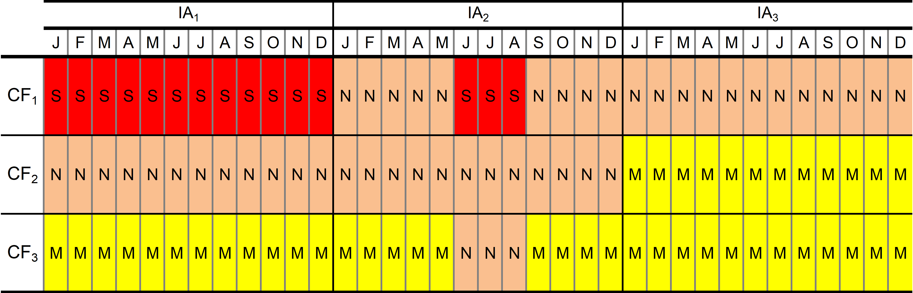
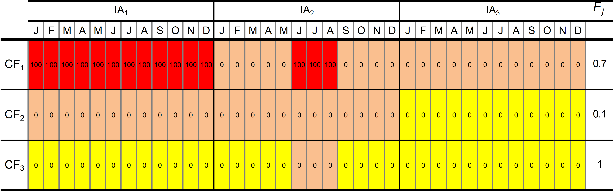
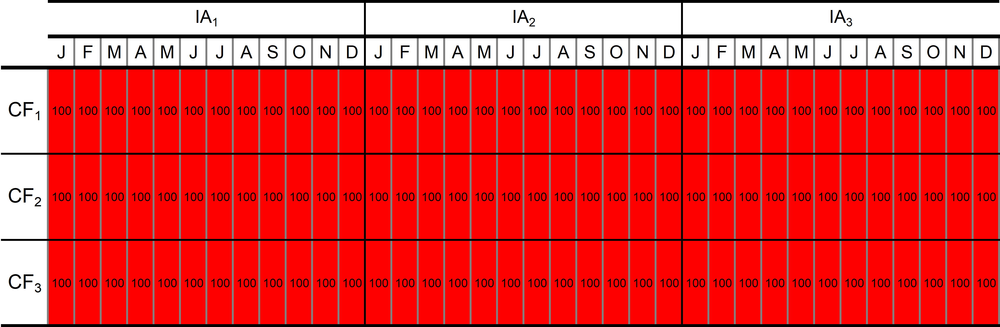

### Geranium indexes explained {.unnumbered}

The conservation concern assessment was undertaken by experts who were asked to assess the level of concern of each activity for every CF in every month of the year, ultimately assigning one of the levels of concern---*minor*, *notable*, or *significant* (M, N, S)---according to their definitions above (see *Section 3*). Note that *not applicable* (*N/A*) was also applied when an activity cannot physically overlap with a CF during that month. Assessing concern level by month allows the seasonality of concern to be taken into account, which is important since seasonal dynamics play a significant role in the Arctic ecosystem. The assessment results were then used to calculate a number of indexes designed to reveal different characteristics of the distribution and intensity of conservation concern across the ArcNet domain and between different areas.

For the purposes of translating the concern levels into numerical indexes that reflect their relative importance, they were assigned concern scores of different weights $W_{m},W_{n},W_{s}$, such that:

$W_{m} = 1,$ $W_{n} = 10$, and $W_{s} = 100$

Therefore, overall concern scores $OCS$, which includes all levels of concern caused by an industrial activity $(i)$ for a CF $(j)$ for any months of the year $(k)$ are given according to:

$$
OCS_{ijk} =
\begin{cases}
W_s, & \text{for "Significant"}, \\
W_n, & \text{for "Notable"}, \\
W_m, & \text{for "Minor"}, \\
N/A, & \text{for "Not Applicable"}.
\end{cases}
$$

Significant concern scores $SCS$, which only include *significant* level of concern, are thus given according to:

$$
SCS_{ijk} =
\begin{cases}
W_s, & \text{for "Significant"}, \\
0, & \text{for "Notable"}, \\
0, & \text{for "Minor"}, \\
N/A, & \text{for "Not Applicable"}.
\end{cases}
$$

These concern scores form the basis of the indexes discussed below, which are also based on the following parameters:

$U$ -- the number of PUs in an AOI;

$U_{0}$ -- the number of PUs in the ArcNet domain, where $U_{0} = 22,678$;

$F_{j}$ -- CF coverage in an AOI, i.e., the proportion of the CF area in the AOI to the total area of that CF. When the AOI is the whole ArcNet domain, $F_{j}^{0} = 1$ for all CFs;

$N_{M}$ -- number of months to be included in the index calculation, which provides a seasonality factor. $N_{M} = 12$ for whole year

$N_{CF}$ -- number of CFs in selection; and

$N_{IA}$ -- number of IAs in the selection.

#### Concern indexes for selected CFs, industrial activities, and AOIs {.unnumbered}

In the following indexes, $OCS_{ijk}$ and $SCS_{ijk}$ are used as the "building blocks" for comparing concern levels between CFs, industrial activities, and AOIs simply by summing the concern scores across selected months of the year. The overall concern $\pmb{OC}$ for the selected CF and IA (i.e., for any CF and IA pair for any given months of the year) is given by:

$${OC}_{ij}^{CF/IA} = \sum_{k}^{by\ months}{{OCS}_{ijk}:{OCS}_{ijk} \neq \frac{N}{A}} ~~~~~~~~~~~~~~~ [1]$$

$${OC}_{jk}^{CF/M} = \sum_{i}^{\text{by IAs}}{{OC}_{ijk}:OC_{ijk}} \neq \frac{N}{A}$$

$${OC}_{ik}^{IA/M} = \sum_{j}^{\text{by CFs}}{OC_{ijk}:OC_{ijk}} \neq \frac{N}{A}$$

and significant concern $\pmb{SC}$ by:

$${SC}_{ij}^{CF/IA} = \sum_{k}^{by\ months}{{SCS}_{ijk}:{SCS}_{ijk} \neq \frac{N}{A}} ~~~~~~~~~~~~~~~ [2]$$

Summing the $OC_{ij}$ or $SC_{ij}$ scores for all CFs and activities in an AOI provides the cumulative overall concern $\pmb{OC\text{-}AOI}$ and the cumulative significant concern $\pmb{SC\text{-}AOI}$, respectively, for that AOI:

$$OC\text{-}AOI = \ \sum_{i}^{\text{by IA}}{\sum_{j}^{\text{by CF}}{F_{j} \cdot {OC}_{ij}^{CF/IA}}} ~~~~~~~~~~~~~~~ [3]$$

and:

$$SC\text{-}AOI = \ \sum_{i}^{\text{by IA}}{\sum_{j}^{\text{by CF}}{F_{j} \cdot {SC}_{ij}^{CF/IA}}} ~~~~~~~~~~~~~~~ [4]$$

where $F_{j}$ scales the $OC$ or $SC$ according to the proportion of the total CF area that occurs in the AOI.

#### Indexes for comparing concern levels {.unnumbered}

In order to compare concern levels between different CFs, activities, or AOIs, they must be normalised. One way to achieve this is to make comparisons against a baseline. The baseline we use in Geranium is the base significant units $B_{ij}$, which is the highest concern score possible for the given comparison. It is calculated using the equation for $SC_{ij}$, where the *significant* concern level is assigned for every month of the year, for every activity, and for every CF in the companion. Thus:

$$
B^{CF/IA}_{ij} = 
\begin{cases}
\infty, & \forall k:OCS_{ijk} = N/A \\
N_{M} \cdot \max(W), & \text{otherwise}. \\
\end{cases}
$$

$$
B^{CF/SM}_{jk} = 
\begin{cases}
\infty, & \forall i:OCS_{ijk} = N/A \\
N_{IA} \cdot \max(W), & \text{otherwise}. \\
\end{cases}
$$

$$
B^{IA/SM}_{ik} = 
\begin{cases}
\infty, & \forall j:OCS_{ijk} = N/A \\
N_{CF} \cdot \max(W), & \text{otherwise}. \\
\end{cases}
$$

For regional applications then where $B$ is scaled by the CF coverage $(F)$:

$$B = \sum_{i}^{\text{by IAs}}{\sum_{j}^{\text{by CFs}}\left( F_{j} \cdot B_{ij}^{CF/IA} \right)} ~~~~~~~~~~~~~~~ [5]$$

Using this baseline, we can compare overall concern levels for a given CF or IA relative to this baseline scenario. The relative overall concern for a CF $(\pmb{ROC\text{-}CF})$ compared to the maximum possible concern level for that CF is given by:

$${ROC\text{-}CF}_{j} = \frac{\sum_{i}^{\text{by IA}}{{OC}_{ij}^{CF/IA}}_{}}{\sum_{i}^{\text{by IA}}B_{ij}^{CF/IA}}\cdot100\% ~~~~~~~~~~~~~~~ [6]$$

Similarly, the relative overall concern for an industrial activity $(\pmb{ROC\text{-}IA})$, is given by:

$${ROC\text{-}IA}_{i} = \frac{\sum_{j}^{\text{by CF}}{(F}_{j} \cdot {OC}_{ij}^{CF/IA})}{\sum_{j}^{\text{by CF}}{(F}_{j} \cdot B_{ij}^{CF/IA})}\cdot100\% ~~~~~~~~~~~~~~~ [7]$$

Here, the comparison also requires normalisation for different CF coverage (*F~j~*) within an AOI. Similarly, for months:

$$ROC\text{-}M_{k}^{M} = \frac{\sum_{j}^{\text{by CFs}}\left( F_{j} \cdot {OC}_{jk}^{CF/SM} \right)}{\sum_{j}^{\text{by CFs}}\left( F_{j} \cdot B_{jk}^{CF/SM} \right)}\cdot100\%$$

We can make a similar comparison for different AOIs, this time considering both overall and significant concern levels. The relative overall concern for an AOI $\pmb{ROC\text{-}AOI}$ and the relative significant concern for an AOI $\pmb{RSC\text{-}AOI}$, which compares cumulative concern levels ($OC\text{-}AOI$ and $SC\text{-}AOI$) to the maximum possible concern for that AOI, are given by:

$$ROC\text{-}AOI = \frac{OC\text{-}AOI}{\sum_{i}^{\text{by IA}}{\sum_{j}^{\text{by CF}}{{{(F}_{j} \cdot B}_{ij})}}}\cdot100\% ~~~~~~~~~~~~~~~ [8]$$

and:

$$RSC\text{-}AOI = \frac{SC\text{-}AOI}{\sum_{i}^{\text{by IA}}{\sum_{j}^{\text{by CF}}{({F_{j} \cdot B}_{ij})}}}\cdot100\% ~~~~~~~~~~~~~~~ [9]$$

Another way to compare concern levels for AOIs is to normalise them by PU. Thus, the relative overall concern $(\pmb{ROC\text{-}PU})$ and the relative significant concern $(\pmb{RSC\text{-}PU})$ for an AOI by PU are given by:

$$ROC\text{-}PU = \frac{OC\text{-}AOI \cdot U^{-1}}{OC_{0} \cdot U_{0}^{-1}} \cdot 100\% ~~~~~~~~~~~~~~~ [10]$$

and:

$$RSC\text{-}PU = \frac{SC\text{-}AOI \cdot U^{-1}}{SC_{0} \cdot {U_{0}}^{-1}} \cdot 100\% ~~~~~~~~~~~~~~~ [11]$$

where $U$ is the number of PUs in the AOI, $U_{0}$ is the number of PUs in the ArcNet domain $(U_{0} = 22,678)$ and $OC_{0}$ and $SC_{0}$ are the overall and significant concern, respectively, for the ArcNet domain as calculated by:

$$OC_{0} = \sum_{i}^{\text{by IA}} \sum_{j}^{\text{by CF}_{0}} {F_{j} \cdot OC}_{ij}^{CF/IA} ~~~~~~~~~~~~~~~ [12]$$

and:

$$SC_{0} = \sum_{i}^{\text{by IA}} \sum_{j}^{\text{by CF}_{0}} {F_{j} \cdot SC}_{ij}^{CF/IA} ~~~~~~~~~~~~~~~ [13]$$

where $CF_{0} = 705$, the number of ArcNet CFs included in Geranium.

To put $OC-AOI$ on the map we need to calculate it for each PU.

Let's define $A_{uj}^{CF}$ as amount of conservation feature $CF_{j}$ in PU $u$ which is normalised to the total $CF_{j}$ amount.

Overall concern for one CF in one PU will be:

$$OC\text{-}P_{j}^{CF} = \sum_{i}^{\text{by IAs}}\frac{{OC}_{ij}^{CF/IA}}{B_{ij}^{CF/IA}}$$

For each PU overall concern will be:

$$OC\text{-}P_{u} = \sum_{j}^{\text{by CFs}}{OC\text{-}P_{j}^{CF} \cdot A_{uj}^{CF}}.$$

#### Case study for conservation concern indexes {.unnumbered}

Consider an area of interest (AOI) that contains three CFs, $CF = \{{CF}_{1},{CF}_{2},{CF}_{3}\}$, and where only three industrial activities are physically possible, $IA = \{{IA}_{1},{IA}_{2},{IA}_{3}\}$. A completed concern table is shown in Table 1.

Table 1. Conservation concern assessment table for our AOI.

{width="100%"}

In the calculation of the indexes, the three levels of concern have been given weight scores, $W = \{ W_{m},W_{n},W_{s}\}$ to reflect their relative importance, where:

$$W_{m} = 1, W_{n} = 10, W_{s} = 100.$$

Another important piece of information is that the AOI overlaps with 70%, 10%, and 100% of the total areas of CF~1~, CF~2~, and CF~3~, respectively.

Therefore, the coverage, $F = \{ F_{1},F_{2},F_{3}\}$, of the CFs in the AOI are:

$$F_{1} = 0.7, F_{2} = 0.1, F_{3} = 1.0.$$

Substituting these weights into Table 1 and adding a column for coverage, $F$, gives Tables 2 and 3 for $OC$ and $SC$, respectively.

Table 2. Conservation concern assessment table with $OC$ weights.

{width="100%"}

Table 3. Conservation concern assessment table with $SC$ weights.

{width="100%"}

The "building blocks" $OC_{ij}$ and $SC_{ij}$ for the AOI can be calculated using equation [1]:

> $${OC}_{ij} = \sum_{k}^{by\ months}{{OCS}_{ijk}:{OCS}_{ijk} \neq \frac{N}{A}}$$

> $OC_{IA_{1}CF_{1}} = 100 + 100 + 100 + 100 + 100 + 100 + 100 + 100 + 100 + 100 + 100 + 100 = 1200$

> $OC_{IA_{1}CF_{2}} = 10 + 10 + 10 + 10 + 10 + 10 + 10 + 10 + 10 + 10 + 10 = 120$

> $OC_{IA_{1}CF_{3}} = 1 + 1 + 1 + 1 + 1 + 1 + 1 + 1 + 1 + 1 + 1 = 12$

> $OC_{IA_{2}CF_{1}} = 10 + 10 + 10 + 10 + 100 + 100 + 100 + 10 + 10 + 10 + 10 = 380$

> $OC_{IA_{2}CF_{2}}= 120$

> $OC_{IA_{2}CF_{3}} = 39$

> $OC_{IA_{3}CF_{1}} = 120$

> $OC_{IA_{3}CF_{2}}= 12$

> $OC_{IA_{3}CF_{3}}= 12$

and equation [2]:

> $${SC}_{ij} = \sum_{k}^{by\ months}{{SCS}_{ijk}:{SCS}_{ijk} \neq \frac{N}{A}}$$

> $SC_{IA_{1}CF_{1}} = 100 + 100 + 100 + 100 + 100 + 100 + 100 + 100 + 100 + 100 + 100 + 100 = 1200$
     
> $SC_{IA_{1}CF_{2}} = 0 + 0 + 0 + 0 + 100 + 100 + 100 + 0 + 0 + 0 + 0 = 300$
     
> $SC_{IA_{1}CF_{3}} = 0$
     
> $SC_{IA_{2}CF_{1}} = 0$
     
> $SC_{IA_{2}CF_{2}} = 0$
     
> $SC_{IA_{2}CF_{3}} = 0$
     
> $SC_{IA_{3}CF_{1}} = 0$
     
> $SC_{IA_{3}CF_{2}} = 0$
     
> $SC_{IA_{3}CF_{3}} = 0$

Then, $OC\text{-}AOI$ is calculated using equation [3]:

> $$OC\text{-}AOI = \ \sum_{i}^{\text{by IA}}{\sum_{j}^{\text{by CF}}{F_{j} \cdot OC}_{ij}}$$

> $OC\text{-}AOI = \left( F_{1} \cdot {OC}_{IA_{1}CF_{1}} + F_{2} \cdot {OC}_{IA_{1}CF_{2}} + F_{3} \cdot {OC}_{IA_{1}CF_{3}} \right) +$
> $+ \left( F_{1} \cdot {OC}_{IA_{2}CF_{1}} + F_{2} \cdot {OC}_{IA_{2}CF_{2}} + F_{3} \cdot {OC}_{IA_{2}CF_{3}} \right) + \left( F_{1} \cdot {OC}_{IA_{3}CF_{1}} + F_{2} \cdot {OC}_{IA_{3}CF_{2}} + F_{3} \cdot {OC}_{IA_{3}CF_{3}} \right)$

> $OC\text{-}AOI = (0.7 ⋅ 1200 + 0.1 ⋅ 120 + 1.0 ⋅ 12) + ( 0.7 ⋅ 380 + 0.1 ⋅ 120 + 1.0 ⋅ 39) + ( 0.7 ⋅ 120 + 0.1 ⋅ 12 + 1.0 ⋅ 12)$

> $OC\text{-}AOI = (840 + 12 + 12) + (266 + 12 + 39) + (84 + 1.2 + 12)$

> $OC\text{-}AOI = 1278.2$

and $SC\text{-}AOI$ is calculated using equation [4]:

> $$SC\text{-}AOI = \ \sum_{i}^{\text{by IA}}{\sum_{j}^{\text{by CF}}{F_{j} \cdot SC}_{ij}}$$

> $SC\text{-}AOI = \left( F_{1} \cdot {SC}_{IA_{1}CF_{1}} + F_{2} \cdot {SC}_{IA_{1}CF_{2}} + F_{3} \cdot {SC}_{IA_{1}CF_{3}} \right) +$
> $+ \left( F_{1} \cdot {SC}_{IA_{2}CF_{1}} + F_{2} \cdot {SC}_{IA_{2}CF_{2}} + F_{3} \cdot {SC}_{IA_{2}CF_{3}} \right) + \left( F_{1} \cdot {SC}_{IA_{3}CF_{1}} + F_{2} \cdot {SC}_{IA_{3}CF_{2}} + F_{3} \cdot {SC}_{IA_{3}CF_{3}} \right)$

> $SC\text{-}AOI = (0.7 ⋅ 1200 + 0.1 ⋅ 300 + 1.0 ⋅ 0) + ( 0.7 ⋅ 0 + 0.1 ⋅ 0 + 1.0 ⋅ 0) + (0.7 ⋅ 0 + 0.1 ⋅ 0 + 1.0 ⋅ 0)$

> $SC\text{-}AOI = (840 + 30)$

> $SC\text{-}AOI = 870$

The relative indexes compare concern levels to the base significant units $(B)$ baseline; the highest possible concern level for any given AOI, where significant concern is assigned for every activity, for every CF, and for every month of the year (Table 4).

Table 4: Theoretical conservation concern assessment table for the base significant units, $B_{ij}$.

{width="100%"}

Calculating $B$ using Table 4 with equation [5], we can compare concern levels for a CF relative to the worst-case scenario baseline using $\pmb{ROC-CF}$ equations [6]:

> $${ROC\text{-}CF}_{j} = \frac{\sum_{i}^{\text{by IA}}{{OC}_{ij}^{CF/IA}}_{}}{\sum_{i}^{\text{by IA}}B_{ij}^{CF/IA}} \cdot 100\%$$

for CF~1~:

> ${ROC\text{-}CF}_{1} = \frac{1200 + 380 + 120}{1200 + 1200 + 1200} \cdot 100\%$

> ${ROC\text{-}CF}_{1} = \frac{1700}{3600} \cdot 100\% = 47.2\%$

CF~2~:

> ${ROC\text{-}CF}_{2} = \frac{120 + 120 + 12}{1200 + 1200 + 1200} \cdot 100\%$

> ${ROC\text{-}CF}_{2} = \frac{252}{3600} \cdot 100\% = 7.0\%$

and CF~3~:

> ${ROC\text{-}CF}_{3} = \frac{12 + 39 + 12}{1200 + 1200 + 1200} \cdot 100\%$

> ${ROC\text{-}CF}_{3} = \frac{63}{3600} \cdot 100\% = 1.75\%$

and we can compare concern levels for an IA relative to the worst-case scenario baseline using $\pmb{ROC-IA}$ and equation [7]:

> $${ROC\text{-}IA}_{i} = \frac{\sum_{j}^{\text{by CF}}F_{j} \cdot {OC}_{ij}}{\sum_{j}^{\text{by CF}}F_{j} \cdot B_{ij}} \cdot 100\%$$

for IA~1~:

> ${ROC\text{-}IA}_{1} = \frac{0.7⋅1200 + 0.1⋅120 + 1⋅12}{0.7⋅1200 + 0.1⋅1200 + 1⋅1200} \cdot 100\%$
>
> ${ROC\text{-}IA}_{1} = \frac{840 + 12 + 12}{840 + 120 + 1200} \cdot 100\%$
>
> ${ROC\text{-}IA}_{1} = \frac{864}{2160} \cdot 100\% = 40\%$

IA~2~:

> ${ROC\text{-}IA}_{2} = \frac{0.7⋅380 + 0.1⋅120 + 1⋅39}{0.7⋅1200 + 0.1⋅1200 + 1⋅1200} \cdot 100\%$
>
> ${ROC\text{-}IA}_{2} = \frac{266 + 12 + 39}{840 + 120 + 1200} \cdot 100\%$
>
> ${ROC\text{-}IA}_{2} = \frac{317}{2160} \cdot 100\% = 14.7\%$

and IA~3~:

> ${ROC\text{-}IA}_{3} = \frac{0.7⋅120 + 0.1⋅12 + 1⋅12}{0.7⋅1200 + 0.1⋅1200 + 1⋅1200} \cdot 100\%$
>
> ${ROC\text{-}IA}_{3} = \frac{84 + 1.2 + 12}{840 + 120 + 1200} \cdot 100\%$
>
> ${ROC\text{-}IA}_{3} = \frac{97.2}{2160} \cdot 100\% = 4.5\%$

Using the same baseline, ***ROC-AOI*** and ***RSC-AOI***, express overall and significant concern levels, respectively, of an AOI compared to the worst-case scenario for that AOI. Thus, using equation [8] we can calculate *ROC-AOI* for our example:

> $$ROC\text{-}AOI = \frac{OC\text{-}AOI}{\sum_{i}^{\text{by IA}}{\sum_{j}^{\text{by CF}}{F_{j} \cdot B}_{ij}}} \cdot 100\%$$

> $ROC\text{-}AOI = \frac{1278.2}{\left( 0.7⋅1200 + 0.1⋅1200 + 1⋅1200 \right) + \left( 0.7⋅1200 + 0.1⋅1200 + 1⋅1200 \right) + \left( 0.7⋅1200 + 0.1⋅1200 + 1⋅1200 \right)} \cdot 100\%$

> $ROC\text{-}AOI = \frac{1278.23}{6480} \cdot 100\%$
>
> $ROC\text{-}AOI = 19.7\%$

and similarly using equation [9], we can calculate *RSC-AOI* for our example:

> $$RSC\text{-}AOI = \frac{SC\text{-}AOI}{\sum_{i}^{\text{by }\text{IA}}{\sum_{j}^{\text{by CF}}{F_{j} \cdot B}_{ij}}} \cdot 100\%$$

> $RSC\text{-}AOI = \frac{870}{6480} \cdot 100\%$

> $RSC\text{-}AOI = 13.4\%$

These indexes tell us that the overall and significant concern level for our AOI is 19.7 and 13.4% of the highest possible concern given the CFs and IAs in the area.

Finally, the last two indexes, look at concern levels normalised by the number of PU in the AOI $U$ versus the number in the ArcNet domain $U_{0}$. For our example, let's say there are 10 PUs in our AOI $(U = 10)$ and 100 PUs in ArcNet $(U_{0} = 100)$. Also, for these last two indexes, we need to know the overall $(OC_{0})$ and significant $(SC_{0})$ concern for the domain as a whole, using equations [12] and [13], respectively. For our example, let's assume $OC_{0} = 10,000$ and $SC_{0} = 9,000e$. Now we can calculate the overall concern level normalised by PU (***ROC-PU***) using equation [10]:

> $$ROC\text{-}PU = \frac{OC\text{-}AOI \cdot U^{- 1}}{OC_{0} \cdot U_{0}^{- 1}} \cdot 100\%$$

> $ROC\text{-}PU\  = \frac{1278.2 \cdot 10^{-1}}{10000 \cdot 100^{-1}} \cdot 100\%$
>
> $ROC\text{-}PU\  = \frac{127.82}{100}$
>
> $ROC\text{-}PU\  = 128\%$

indicating that the cumulative overall conservation concern for the PUs in the AOI is 128% that of the whole domain.

Similarly, we can now calculate the significant concern level normalized by PU (***ROC-PU***) using equation [11]:

> $$RSC\text{-}PU = \frac{SC\text{-}AOI \cdot U^{- 1}}{SC_{0} \cdot {U_{0}}^{- 1}} \cdot 100\%$$

where $SC_{0}$ is the $SC_{aoi}$ index for the ArcNet domain. Let's assume for this example that $SC_{0} = 9,000$. Therefore, $RSC\text{-}PU$ is calculated as follows:

> $RSC\text{-}PU\  = \frac{870 \cdot 10^{-1}}{9000 \cdot 100^{-1}} \cdot 100\%$
>
> $RSC\text{-}PU\  = \frac{87}{90} \cdot 100\%$
>
> $RSC\text{-}PU\  = 97\%$

indicating that the cumulative significant conservation concern for the PUs of the AOI is 97% that of the whole.

#### Industrial Pressure Indexes {.unnumbered}

A number of indexes were developed to measure industrial pressure levels based on conservation concern, conservation need, and the distribution of current and planned industrial activities in the ArcNet domain.

**Industrial Activity** **Amount, relative (AA-PU)** is a measure of the cumulative amount or occurrence of industrial activities per PU, normalised and averaged for each PU. It is indicative of the overall industrial presence that exists for each AOI compared to the average presence across the ArcNet domain. It is derived as follows:

$A_{uik}^{IA/M}$ is the amount in PU $u$ for industrial activity, i, and month, *k*. Therefore, the IA amount by season is:

$$A_{ui}^{IA} = \sum_{k}^{\text{by months}}w_{i} \cdot A_{uik}^{IA/M},$$

where $\forall i\ \exists!w_{i}:\sum_{u}^{\text{by PUs}^{0}}A_{ui}^{IA} = 100$ for ArcNet domain.

The industrial activity amount for a given season is given by:

$$A_{uk}^{M} = \sum_{i}^{\text{by IAs}}w_{i} \cdot A_{uik}^{IA/M}.$$

All values are calculated per single PU.

The cumulative amount of all industrial activities in a given AOI (*AA~aoi~) is*:

$${AA}_{aoi} = \sum_{i}^{\text{by IAs}}A_{ui}^{IA}$$

and averaged by PU:

$$AA\text{-}PU = \frac{\left( \sum_{u}^{\text{by PUs}}{AA}_{u} \right)/U}{\left( \sum_{u}^{\text{by PUs}^{0}}{AA}_{u} \right)/U_{0}}\  \cdot 100\%;$$

where $\left( \sum_{u}^{\text{by PUs}}{AA}_{u} \right)/U$ is the mean value of all PUs inside the selected AOI, and $\left( \sum_{u}^{\text{by PUs}^{0}}A_{u} \right)/U_{0}$ is the mean value of all PUs for ArcNet domain.

**Overall industrial pressure indexes (OIP)** are calculated per PU according to:

$${OIP}_{ui}^{IA} = A_{ui}^{IA}\sum_{j}^{\text{by CFs}}\left( A_{j}^{CF} \cdot {OC}_{ij}^{CF/IA} \right)$$

$${OIP}_{uk}^{M} = A_{uk}^{M}\sum_{j}^{\text{by CFs}}{{(A}_{j}^{CF} \cdot {OC}_{jk}^{CF/M}})$$

$$OIP\text{-}B_{ui}^{IA} = A_{ui}^{IA}\sum_{j}^{\text{by CFs}}{{(A}_{j}^{CF} \cdot B_{ij}^{CF/IA}})$$

$$OIP\text{-}B_{uk}^{M} = A_{uk}^{M}\sum_{j}^{\text{by CFs}}{{(A}_{j}^{CF} \cdot B_{jk}^{CF/M}})$$

$${OIP}_{uj}^{CF} = A_{uj}^{CF}\sum_{i}^{\text{by IAs}}{(A_{i}^{IA} \cdot {OC}_{ij}^{CF/IA}})$$

$$OIP\text{-}B_{uj}^{CF} = A_{uj}^{CF}\sum_{i}^{\text{by IAs}}{{(A}_{i}^{IA} \cdot B_{ij}^{CF/IA}})$$

Using these, the overall industrial pressure indexes for an industrial activity are given by:

$$OIP\text{-}IA_{i}^{IA} = \sum_{u}^{\text{by PUs}}{OIP}_{ui}^{IA}$$

$$OIP\text{-}B_{i}^{IA} = \sum_{u}^{\text{by PUs}}{OIP\text{-}B}_{ui}^{IA}$$

Similarly, the overall industrial pressure indexes for a CF are given by:

$${OIP\text{-}CF}_{j}^{CF} = \sum_{u}^{\text{by PUs}}{OIP}_{uj}^{CF}$$

$$OIP\text{-}B_{j}^{CF} = \sum_{u}^{\text{by PUs}}{OIP\text{-}B}_{uj}^{CF}$$

and the overall industrial pressure indexes for a given month are:

$${OIP\text{-}M}_{k}^{M} = \sum_{u}^{\text{by PUs}}{OIP}_{uk}^{M}$$

$${OIP\text{-}B}_{k}^{M} = \sum_{u}^{\text{by PUs}}{OIP\text{-}B_{uk}^{M}}$$

For generating the industrial activity pressure bar plots allowing comparison between different industrial activities, the OIP values are normalised to give the relative overall industrial pressure (*ROIP*):

$$ROIP\text{-}{IA}_{i}^{IA} = \frac{OIP\text{-}IA_{i}^{IA}}{OIP\text{-}B_{i}^{IA}} \cdot 100\%$$

Expressed for the seasonal activity pressure bar plots we use:

$$ROIP\text{-}M_{k}^{M} = \frac{OIP\text{-}M_{k}^{M}}{OIP\text{-}B_{k}^{M}} \cdot 100\%$$

for CFs:

$$ROIP\text{-}{CF}_{j}^{CF} = \frac{OIP\text{-}{CF}_{j}^{CF}}{OIP\text{-}B_{uj}^{CF}} \cdot 100\%$$

And to map overall industrial pressure by calculating it for each PU:

<!--
$$OIP\text{-}PU = \frac{\sum_{i}^{\text{by IAs}}{OIP}_{ui}^{IA}}{\sum_{i}^{\text{by IAs}}{OIP\text{-}}B_{ui}^{IA}} \cdot 100\%$$
-->

$$OIP\text{-}P_{u} = \sum_{i}^{\text{by IAs}}{OIP}_{ui}^{IA}$$

**ROIP-AOI (Relative** **Overall Industrial Pressure AOI)** -- an index calculated as a percentage of a maximum potential pressure for AOI. It compares level of industrial pressure for AOI to its highest possible theoretical values and highlights areas where the pressure is the highest due to both -- amount of industrial activities and susceptibility of conservation features to concerns arising from these activities**.**

$$ROIP\text{-}AOI = \sum_{u}^{by\ PUs}\frac{\sum_{i}^{byIAs}{OIP}_{ui}^{IA}}{\sum_{i}^{by\ IAs}{OIP\text{-}B}_{ui}^{IA}} \cdot 100\%$$

**Overall Industrial Pressure, per planning unit (OIP-PU)** is a measure showing the relative overall industrial pressure level for an AOI compared to the average level for the ArcNet domain and is based on the overall concern (OC) throughout the year for every CF and IA in a given AOI relative to that of the ArcNet domain. The OIP-PU allows for the comparison of differing industrial pressures within given AOIs and with those of the ArcNet domain.

To calculate OIP-PU, the overall industrial pressure level $(OIP_{aoi})$ in a given selected area has to be calculated:

$$OIPaoi = \sum_{i}^{\text{by IAs}}{OIP\text{-}IA_{i}^{IA}} = \sum_{i}^{\text{by IAs}}{\sum_{u}^{\text{by PUs}}{OIP}_{ui}^{IA}}$$

$${OIP}_{0} = \sum_{i}^{\text{by IAs}}{\sum_{u}^{\text{by PUs}^{0}}{OIP}_{ui}^{IA}}$$

Then OIP-PU is calculated by expressing the OIP of the AOI as a percentage of that of the whole domain $(OIP_{0})$, averaged by the number of PU:

$$OIP\text{-}PU = \frac{OIPaoi}{{OIP}_{0}} \cdot 100\%.$$
