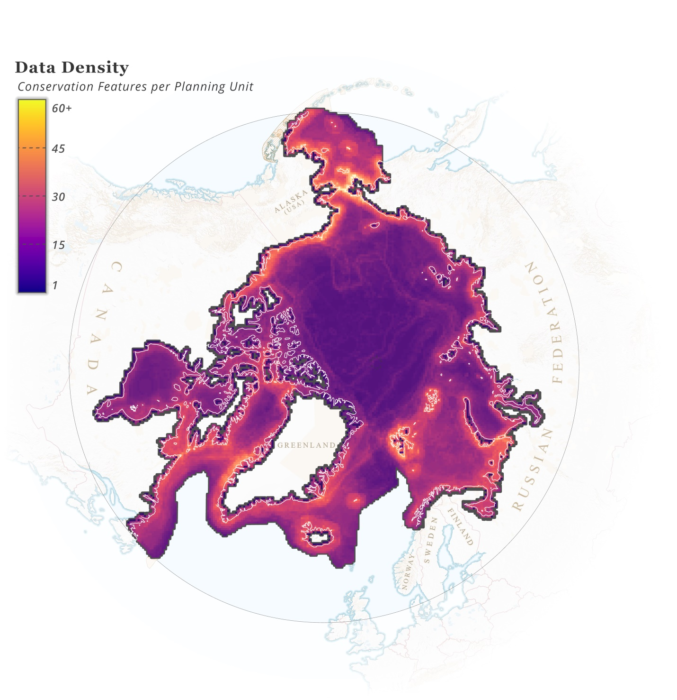
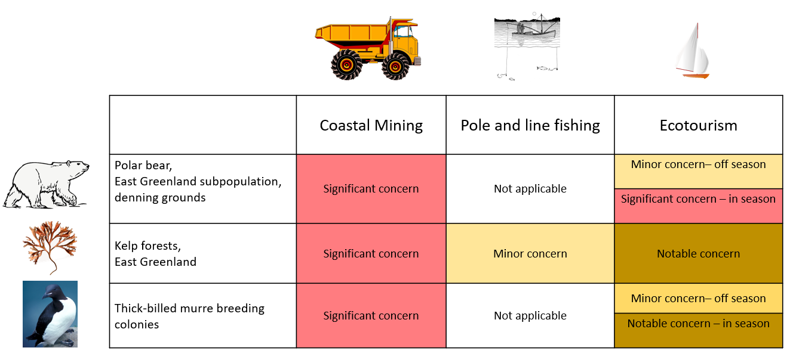
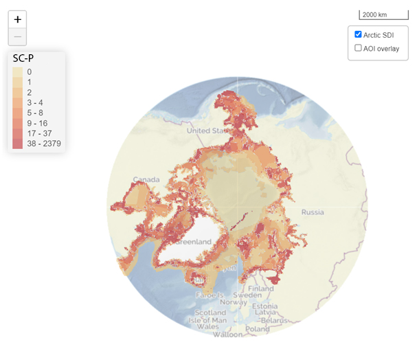
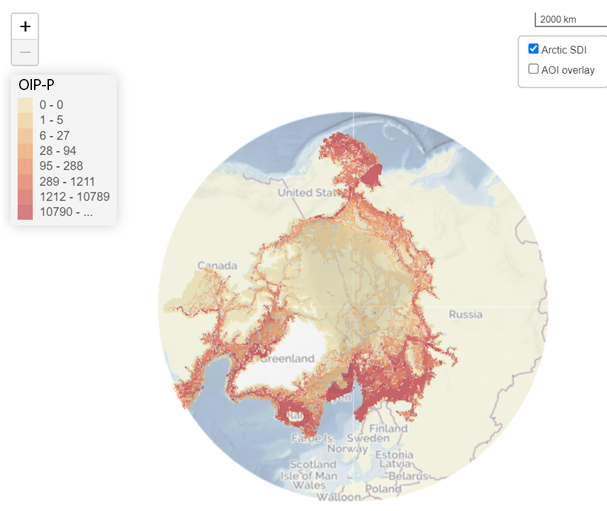

Geranium is an extensive database on the distribution of 704 Conservation Features (CFs) that systematically represent marine biodiversity in the Arctic: from benthos to marine mammals.

*Distribution of layers representing ArcNet CFs (James et. al, 2024).*

Geranium provides insights into 33 Industrial Activities with information on their current and planned distribution, including: aquaculture, fisheries, infrastructure, mining, shipping, and tourism.

*Distribution of industrial activities amount in the Arctic in the "up to 2025" epoch according to Geranium*

## What does Geranium assess?

Geranium assesses the level of *conservation concern* caused by each existing or potential an industrial activity for each of the CFs using a simple three-level approach where:

-   *Minor concern* (yellow) - Related risks, if any, are mitigatable through comprehensively adhering to existing environmental standards and best practices.

-   *Notable* concern (brown) - Related risks require mitigation through activity-specific and/or habitat/biotope-specific considerations if the activity takes place.

-   *Significant* concern (red) - Related risks are assessed as non-mitigatable through activity-specific and/or habitat/ biotope-specific considerations.

-   *Not applicable* (N/A) - An activity cannot physically occur/does not spatially or seasonally overlap with a CF (habitat/biotope) or any other given area.

Geranium looks at the industrial activity-biodiversity feature interaction from the long-term conservation goal perspective rather than within an environmental impact assessment framework.

## The Geranium assessment results

Mapping the results of the Geranium conservation *concern* assessment will help conservation and marine spatial planners to determine what industries/commercial activities may cause a concern in each area of interest and what conservation requirements should be applied to these activities.

Several metrics were developed to help conservation planners identify conservation needs for a given area based on overlay of individual conservation concern levels for each conservation feature in each area.

*Conservation concern level for PU (SC-P) distribution.*

The above map reveals areas of *significant* concern where risks were assessed as non-mitigatable through activity-specific and/or habitat/biotope-specific considerations based on the distribution of CFs and potential overlap with the set of 33 commercial activities.

The map below is based on conservation concern metrics and information on industrial activities distribution. It shows distribution of overall industrial pressure allowing to prioritise areas where high potential risks for biodiversity conservation (conservation concern) overlap with the presence of industrial activities causing these specific risks.

*Overall Industrial Pressure level for PU (OIP-P) distribution.*
