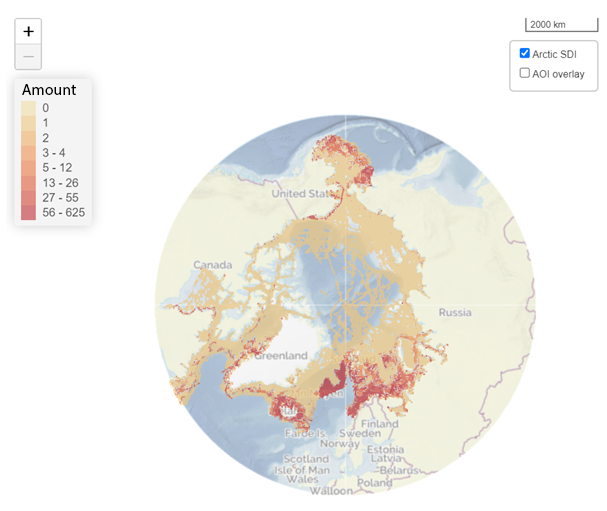

# Geranium First Page

##

###

**Geranium** -- online tool to translate biological information into practical steps for area-based management, conservation, planning and prioritisation from a pan-Arctic perspective. 

It is designed to help:

Identify effective and appropriate conservation measures for any selected marine area in the Arctic.

Prioritise investments into implementation efforts, partnerships, and funding.

Organise and facilitate engagement across rightsholders and stakeholders.

Make the decisions transparent and systematic.

An extensive database on distribution

of 704 Conservation Features systematically

representing marine biodiversity in the Arctic:

from benthos to marine mammals.

> 33 Commercial Activities with information
>
> on their current and planned distribution:
>
> aquaculture, fisheries, infrastructure,
>
> mining, shipping, and tourism.

Geranium assesses level of *conservation concern* caused by each existing or potential a commercial activity for each of the CFs using a simple three-level approach where:

-   *Minor concern* (yellow), (M) - Related risks, if any, are mitigatable through comprehensively adhering to existing environmental standards and best practices.

-   *Notable* concern (brown), (N) - Related risks require mitigation through activity-specific and/or habitat/ biotope-specific considerations if the activity takes place.

-   *Significant* concern (red), (S)- Related risks are assessed as non-mitigatable through activity-specific and/or habitat / biotope-specific considerations.

-   *Not applicable*, (N/A) - An activity cannot physically occur / does not spatially or seasonally overlap with a CF (habitat / biotope) or any other given area.

{width="6.268055555555556in" height="2.7569444444444446in"}

Geranium looks at the commercial activity-biodiversity feature interaction from the long-term conservation goal perspective rather than within environmental impact assessment framework.

Results of the Geranium conservation *concern* assessment put on the map will help conservation and marine spatial planners to figure out what industries/commercial activities may cause a concern in each area of interest and what conservation requirements should be applied for these activities.

Several metrics were developed to developed to help conservation planners identify conservation needs for a given area based on overlay of individual conservation concern levels for each CF in each area.

{width="5.333333333333333in" height="3.9482972440944883in"}

Significant Relative Level of Conservation Concern Distribution. The map demonstrates where the overall risks assessed as non-mitigatable through activity-specific and/or habitat / biotope-specific considerations are highest based on distribution of CFs and potential distribution of the set of 33 commercial activities.

Based on conservation concern metrics and information on commercial activities distribution conservation action priority metrics were developed to prioritise areas where potential risks (conservation concern) overlap existing industrial activities.

[MAP]{.mark}

DISCLAIMER: The assessment had to encompass 705 conservation features, 12 months of a year and 33 commercial activities, meaning that the assessors had 279 180 decisions to make. No need to explain that to make all these decisions right and consistently is an impossible task, especially in the area where sometimes there is no single right answer or enough scientific data to make a decision. As the Arctic is changing very fast and there are more and more industries coming into the region, there are more and more results of research on the impact these activities cause on Arctic biodiversity becoming available. The assessment is designed to help stakeholders and conservation planners to shape the discussion and deeper investigation, to engage rather than to provide a final verdict. There is a dedicated section "Comments" where everyone interested can question existing assessment outputs for each CF and provide their view and rationale. [- formulate.]{.mark}

How can you use Geranium in your work?

[Give 3 examples -- case studies.]{.mark}

Geranium is a part of ArcNet -- Arctic Ocean Network of Priority Areas for Conservation project by WWF Global Arctic Programme.

Learn more about ArcNet (link), read full overview of Geranium (link), see the Manual for detailed instructions (link), bibliography for the sources (link). Check other ArcNet online tools: Chicory and Accenter (links).

Video tutorials -- link / incerts.

Get in contact with the team: email.
