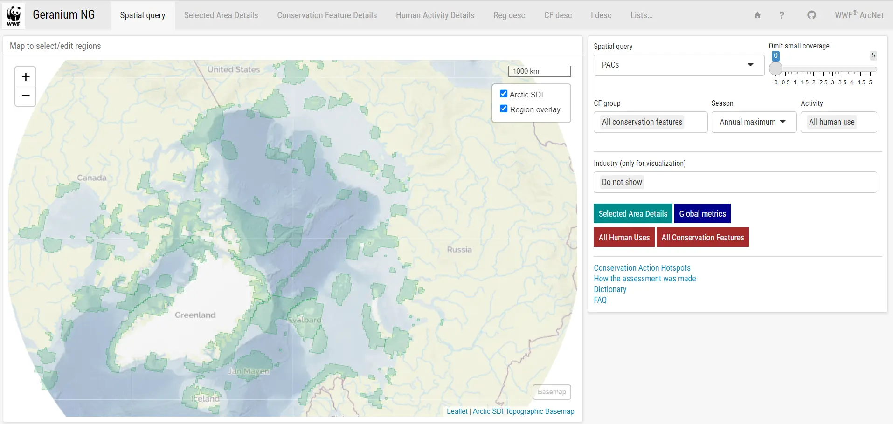
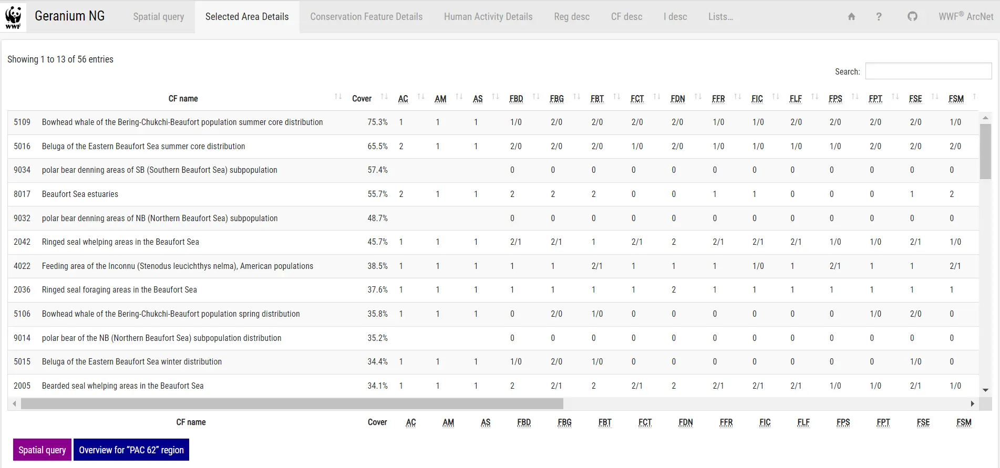
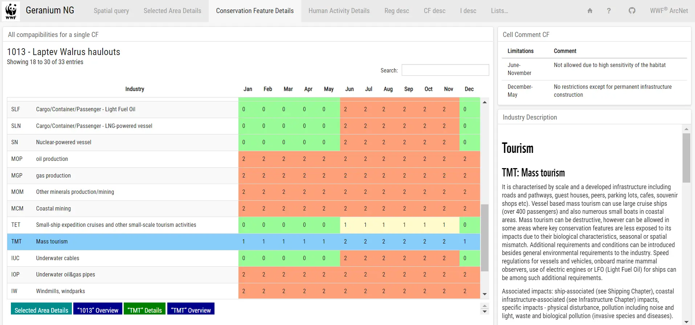
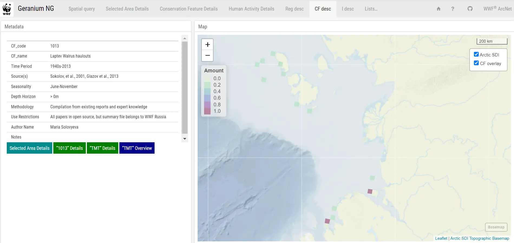
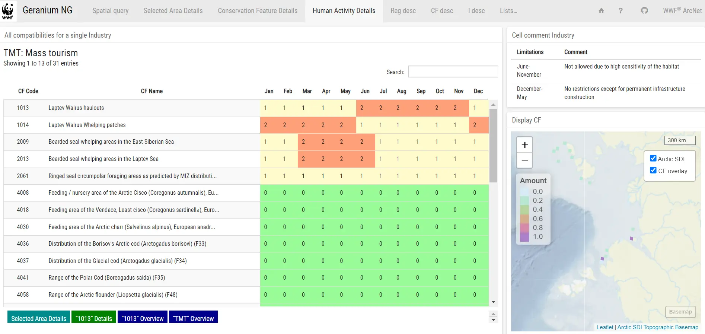
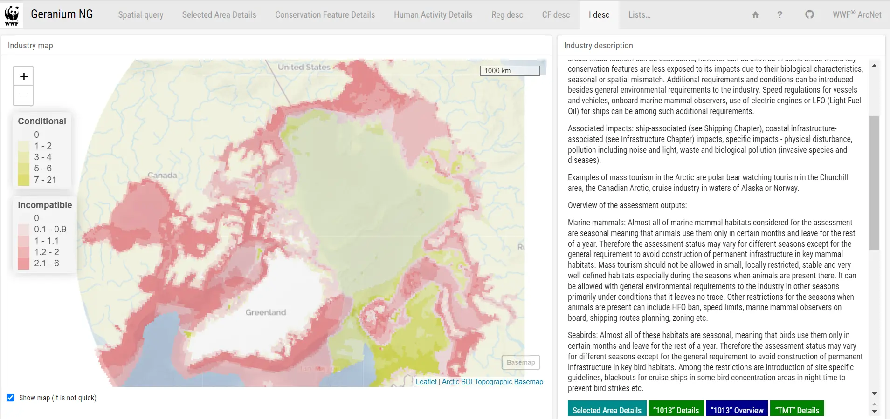
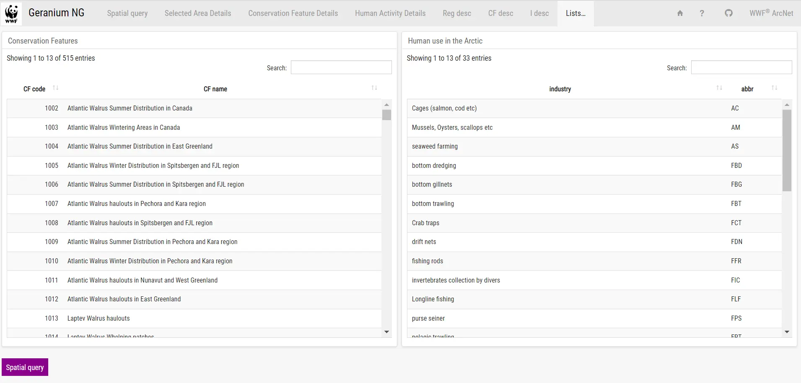

### User manual

[Geranium](https://wwfrussia.shinyapps.io/geranium/#section-map) -- online decision support and engagement prioritisation and visualisation tool for the Arctic Seas conservation planners, WWF national offices, WWF Global Arctic Program and relevant government agencies.

The purpose of the tool is to help conservation planners answer a question: what measures are most effective to ensure preservation of conservation features for each priority area for conservation (PAC), Arctic subregions (e.g. LMEs, EEZ, ecoregions) and for ArcNet area in general. It is aimed to be a tool to organise and facilitate engagement and cooperative processes across marine stakeholders for conservation planning and Marine Spatial Planning

Geranium designed to be used in three different ways for three different tasks:

1. Area-oriented - it is a primary task and a way to use the tool. When you need to find out what measures are most effective to ensure preservation of conservation features in a particular area you can select this area (or chose from preselected) and see which conservation features it has and what sensitivity statuses they have, you can see a general level of conservation concern for this area, which industries/commercial activities are the most problematic, which are least and eventually make the decision on what stakeholders need to be involved and what conservation measures are needed.

2. Industry-oriented. When you need to engage with a specific industry/commercial activity and to see where this industry can cause problems for biodiversity conservation, in what seasons and for which conservation features you can use Geranium for this and start with the selection of an industry. This way will allow you to see also what is required from the industry to ensure specific conservation features are preserved.

3. Conservation feature-oriented. You can start with selection of a conservation feature and see what industries should be a source of concern in its area and what are the feature's requirements and conditions for these industries. This way of using Geranium can help conservation planners to develop species/communities conservation strategies.
   
**Note:** the tool calculates all the statistics and builds maps online (on the fly). Allow 2-3 seconds for pages to load. Main Page (Spatial Query)

The Main Page is the starting page all three ways in Geranium.

**Way 1 - Area-oriented**

**Spatial Query** - you can select PACs, MEOWs or LMEs from the drop-down list. Then select a region by clicking on the map to the left. Select Editor in case you need to customise area borders. Use "Draw a polygon" and other tools on the left side of the map.

Once an area is selected, choose what conservation features you want to see in the analysis (**CF group**). By default the analysis is done for the "All conservation features" group but you can choose one or several taxonomic groups from the drop-down list.

Then choose **Season** for the analysis. By default it shows "Annual maximum" - the strictest limitation for commercial activities through a year (i.e. if oil mining shouldn't be allowed in an area during just month - September, the maps and the tables will consider this activity with the "red" status - "not allowed"), however you can select any month from the list.

**Activity** drop-down list allows you to choose what commercial activities you want to analyse for the selected area. By default it is "All human uses". You can choose between "Fishery", "Aquaculture", "Shipping", "Mining", "Infrastructure", "Tourism" or select several of them.

Also you can adjust sensitivity of the analysis by using the "**Omit small coverage**" slider to select conservation features for which the selected area plays a relatively insignificant role (up to 5% of their amount).

Finally you can preview results of the assessment for various commercial activities using a tool **Industry (only for visualization)**. Selection of an activity here doesn't affect the analysis but it can help you to choose a region or to draw its borders. You can select between different "Colorization" schemes. By default it shows "Incompatible" (Not allowed) index overwriting "Conditional" (Allowed under specific conditions) index.

Once all the parameters are set you can choose "Overview of the selected region". It will lead you to the overview page:

On the left you will see the close-up map of the selected region. You can choose to show Existing Protected Areas on the map. Also you can choose to show NAO (**Show NAO**) and NAC (**Show NAC**) metric distributions. Also you can choose option **Stats for Existing Protected Areas** which will allow you to see the metrics and statistics on the right recalculated for protected areas within the selected region.

On the right side you can see some basic statistics for the selected area (**Basic Statistics**) like:

**PUs** - number of Planning Units (30x30 km) within the selected area;

**CFs** - number of Conservation Features within the selected area (remember this number is affected by the settings of the "Omit small coverage" slider on the Main Page);

**srcArea** - area of selected region in sq. km;

**puArea** - area of selected region in sq. km based on PU borders (vary slightly from scrArea);

**puLand** - terrestrial part area of selected region in sq. km based on PU borders

**puMarine** - marine part area of selected region in sq. km based on PU borders

Below you can find a graph showing the NAC index calculated for each of 33 commercial activities. Colours of the bars separate different groups of activities (fihery, tourism etc.). To the right from the graph three the most (**IND TOP**) and the least (**LC IND**) problematic activities for the area are highlighted.

The lower right part you can find indexes for the selected area:

**NAO - Not Allowed Only** - derivative of composition of Conservation Features (with importance of the selected area for each CF taken into account) in a selected area multiplied by a number of commercial activities not allowed (with "red" status) in this area for each CF multiplied by a number of months when these commercial activities are not allowed for each CF in the area. Overall the metric shows a level of conservation concern, the intolerance of a regional conservation features composition to all possible commercial activities.

**NAС - Not Allowed and Conditional -** is a metric similar to NAO with a difference that it considers "yellow" status assessments - "can be allowed under certain conditions". The formula sums "not allowed" assessments with "conditional" assessments with first having a coefficient/weight of 3 and the latter - 1.

**NAOR - Not Allowed Only, Relative** - is a NAO index normalised by a size of the selected area (number of planning units within a selected area). This metric shows a conservation concern regardless of the size of the selected area (number of PUs).

**NACR - Not Allowed and Conditional, Relative** - NAC normalised by a size of the selected area (number of PUs).

The graph to the right from the indexes shows the region's NAC for each month, with index **SC - Seasons of concern:** three months of a year with the highest NAC in the selected area.

**Download interim tables for NAO and NAC -** allows you to download respective tables for this region.

**Instant report** - allows you to download all the information from the page in the form of a pdf report.

Buttons on the lower left side of the page help to navigate:

**Spatial query** returns to the Main Page,

**Selected area details** button opens the table, showing results of the assessment for each conservation feature and each commercial activity within the selected region.

You can get to the table straight from the Main Page by selecting the "**Selected Area Details**" button instead of the "**Selected Area Overview**" if needed.

The tables list conservation features within the selected area (**CF name**) along with their ID number and the Cover (**Cover**) - percentage of the CF total amount within the selected area.

Then it shows the assessment results for each commercial activity. 2 - goes for the "red", "not allowed" status, 1 - for "yellow", "conditional", 0 - for "green", "allowed". If results of the assessment have seasonal variation, both numbers are shown.

To explore more details on each CF - just click on it and you will see two buttons appear on the bottom-left side of the page: "**CF details**" and "**CF overview**".

If you choose "**CF details**", you will see a page with a table showing results of the assessment for the selected CF for all commercial activities and for each season. By clicking on each line you can read the comments provided by the thematic experts in the top-right section of the page "**Cell comment CF**" and read a description of the industry in the right section of the page "**Industry description**".

If instead of the "**CF details**" you click on "**CF overview**" you will be able to see the metadata of the CF dataset and its map with representation of its amount.

To explore more details on each commercial activity you can click on its index in the respective column - you will see two buttons appear on the bottom-left side of the page: "**Industry details**" and "**Industry overview**".

"**Industry details**" will lead you to the table with results of the assessment for the selected industry and all CFs. By clicking on each CFs you will see comments by the experts and the map showing distribution of the CF.

"Industry overview" will lead you to the page with the map demonstrating distribution of the assessment details for the selected industry and the description of the industry and an overview of the results of the assessment for each taxonomic group.

In the bottom part of each page you can see the navigation buttons allowing you to go back and forth from the starting point and explore results of the assessment for each CF or industry. To go back to the Main Page click on "Geranium NG" on the top-left part of each page.

**Way 2 - Industry-oriented**

Choose "**All Human Uses**" on the Main Page - it will lead you to the page with all commercial activities:

On the right you can select any commercial activity and then explore it using buttons/ pages "**Industry Overview**" and "**Industry Details**" as described in the Way 1.

**Way 3. Conservation Feature-oriented**

   
Select "All Conservation Features" on the Main Page. It will lead you to the page with all conservation features:

On the left you can select any conservation feature and then explore it using buttons/ pages "**CF Overview**" and "**CF Details**" as described in the Way 1.
