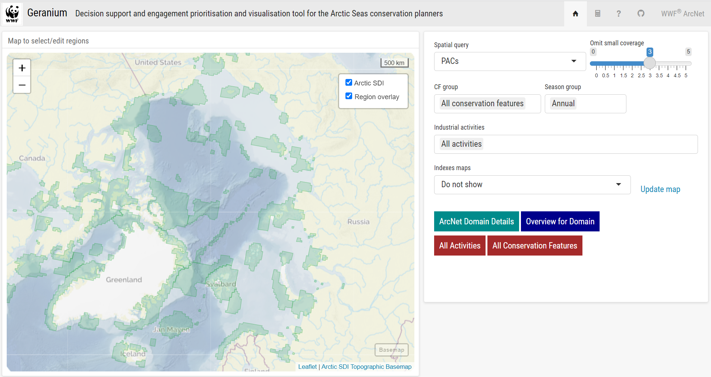
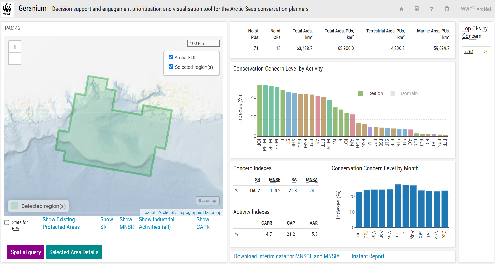
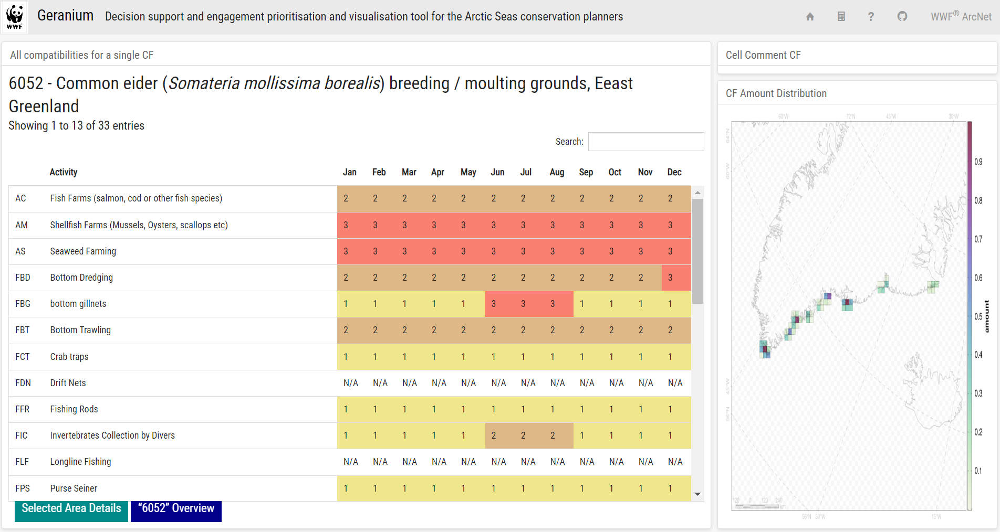
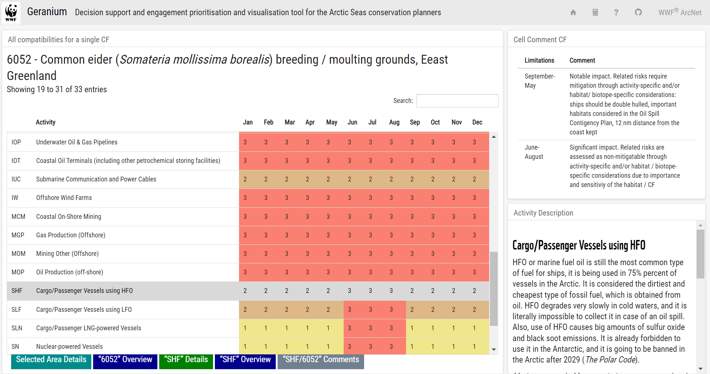
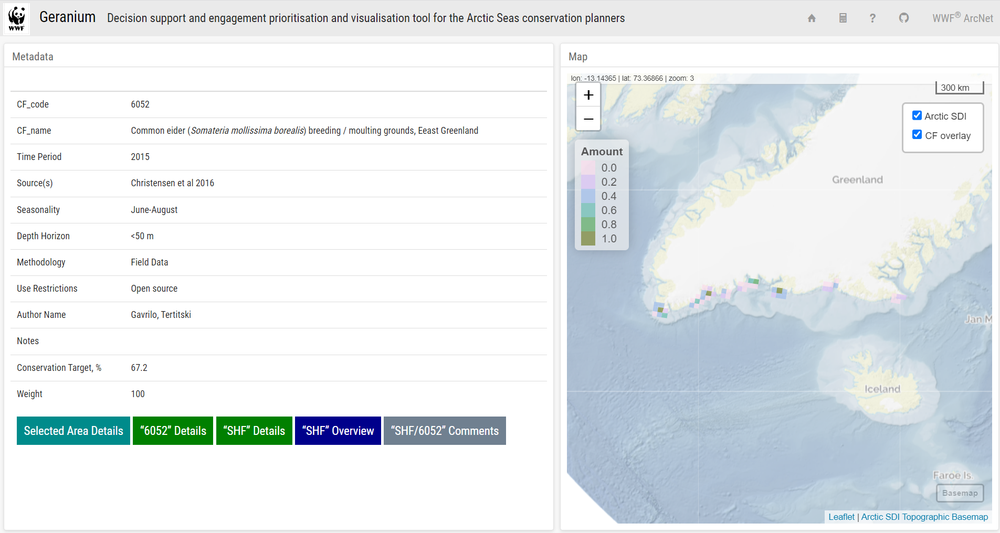
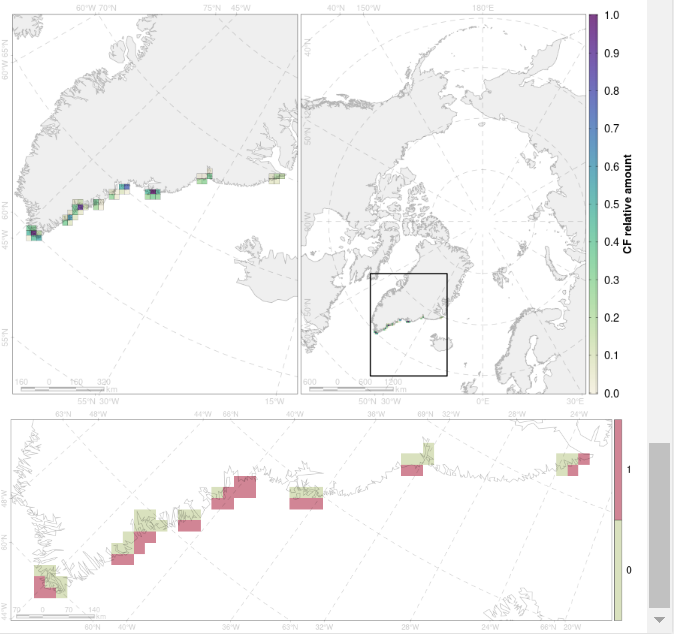
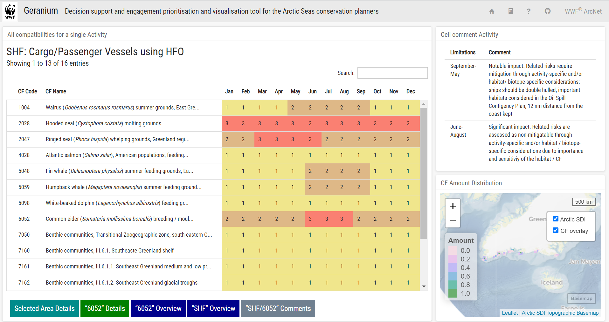
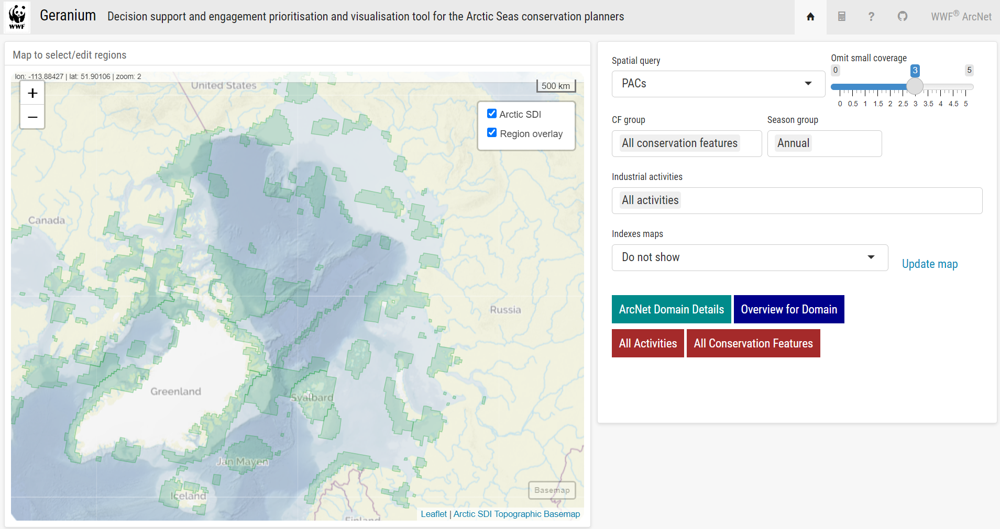
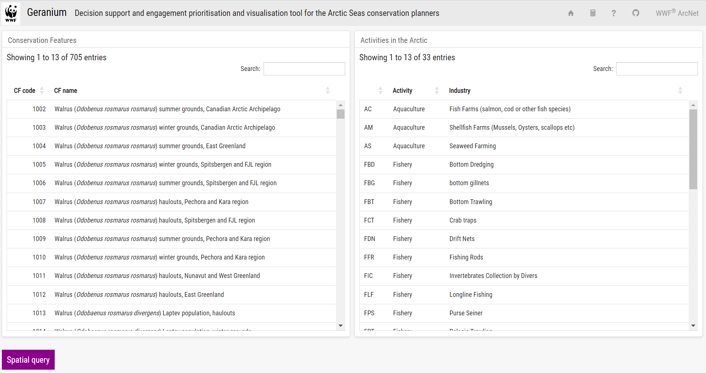

# User Manual

## 

### 

::: {custom-style="First Paragraph"}
[Geranium](https://wwfarcticprogramme.shinyapps.io/geranium/) -- online decision support and engagement prioritisation and visualisation tool for the Arctic Seas conservation planners, WWF, relevant government agencies, and other marine planning professionals involved in marine spatial planning (MSP) and ecosystem assessment (EA) processes in the region.
:::

::: {custom-style="Body Text"}
The purpose of the tool is to translate biological information into practical steps for area-based management, conservation, planning and prioritisation.
:::

::: {custom-style="Body Text"}
It is designed to:
:::

-   Make decisions transparent and systematic

-   Organise and facilitate engagement across stakeholders

-   Help identify effective and sufficient conservation measures

-   Prioritise the allocation of implementation efforts, partnerships, and funding

::: {custom-style="Block Text"}
> **Note:** the tool calculates all the statistics and builds maps online (on the flight). Allow three to five seconds for pages to load.
:::

::: {custom-style="First Paragraph"}
Main Page (Spatial Query)
:::

::: {custom-style="Body Text"}
{width="5.833333333333333in" height="3.104838145231846in"}
:::

::: {custom-style="Body Text"}
The Main Page is the starting page for all calculations and eresearch with Geranium.
:::

::: {custom-style="Body Text"}
**Spatial Query** - you can select *PACs, MEOWs* or *LMEs* from the drop-down list. Then select a region by clicking on the map to the left. Select *Editor* in case you need to customise area borders. Use "Draw a polygon" and other tools on the left side of the map.
:::

::: {custom-style="Body Text"}
Once an area is selected, choose what conservation features you want to see in the analysis (**CF group**). By default the analysis is done for the "*All conservation features*" group but you can choose one or several taxonomic groups from the drop-down list.
:::

::: {custom-style="Body Text"}
Then choose **Season** for the analysis. By default it shows "*Annual maximum*" (All months) - to show the results of the assessment for all months of a year.
:::

::: {custom-style="Body Text"}
**Activity** drop-down list allows you to choose what industrial activities you want to analyse for the selected area. By default it is "*All activities*". You can choose between 33 activities or select several of them.
:::

::: {custom-style="Body Text"}
Also you can adjust sensitivity of the analysis by using the "**Omit small coverage**" slider to select conservation features for which the selected area plays a relatively insignificant role (up to 5% of their amount).
:::

::: {custom-style="Body Text"}
In case you need to see the overall picture for the ArcNet area with the selected parametres before you select an area, you can see results of the assessments using "Indexes maps". By default the "Do not show" option is on; it can be changed for *CAPR* - to see **Conservation Action Priority Level Relative Index.** It shows relative conservation action priority level for a selected area compared to the average level for the ArcNet area.
:::

::: {custom-style="Body Text"}
The other indexes to see are:
:::

::: {custom-style="Body Text"}
SR - **Significant Relative.** A metric showing how high is the average "significant" conservation concern for a planning unit in a selected area compared to an average value of "significant" conservation concern for a planning unit in ArcNet area. It is used to show a relative overall level of concern (just "red" - "significant" level counted) for a selected area and allows users to compare various areas regardless of their size.
:::

::: {custom-style="Body Text"}
**MNSR - Minor Notable Significant Relative Index.** A metric similar to SR, counting all levels of concern including "minor" and "notable" concerns using the following scale ("significant" - 100, "notable" - 10, "minor" - 1).
:::

::: {custom-style="Body Text"}
**Industrial activities acceptability** - Index showing simple overlap of all the assessment outputs for all selected activities and CFs. It can be useful for the situations when an overview of just one activity acceptability or a level of conservation concern it causes is needed.
:::

::: {custom-style="Body Text"}
**Industrial activities amount** - amount of industrial activities per planning unit. Amount of each activity is normalised (0 - 1.0) and averaged for each planning unit. Shows an overall anthropogenic pressure existing in each area compared to the average for ArcNet.
:::

::: {custom-style="Body Text"}
**Update map** - click "*Update map*" when changing the metric to show.
:::

::: {custom-style="Body Text"}
Once all the parameters are set you can choose "Overview of the selected region". It will lead you to the overview page:
:::

::: {custom-style="Body Text"}
{width="6.5in" height="3.473611111111111in"}
:::

::: {custom-style="Body Text"}
On the left you will see the close-up map of the selected region. You can choose to show Existing Protected Areas on the map. Also, you can choose to show SR (**Show SR**), MNSR (**Show MNSR),** CAPR **(Show CAPR)** and AAR **(Show Industrial Activities (all))** metric distributions. Also, you can choose the option "Stats for Existing Protected Areas" (**Stats for EPA**) which will allow you to see the metrics and statistics on the right recalculated for protected areas within the selected region.
:::

::: {custom-style="Body Text"}
On the right side you can see some basic statistics for the selected area (**Basic Statistics**) like:
:::

::: {custom-style="Body Text"}
**No of PUs** - number of Planning Units (30x30 km) within the selected area;
:::

::: {custom-style="Body Text"}
**No of CFs** - number of Conservation Features within the selected area (remember this number is affected by the settings of the "*Omit small coverage*" slider on the Main Page);
:::

::: {custom-style="Body Text"}
**Total area, km^2^**- area of selected region in km^2^;
:::

::: {custom-style="Body Text"}
**Total area, PUs, km^2^** - area of selected region in km^2^ based on PU borders (vary slightly from scrArea);
:::

::: {custom-style="Body Text"}
**Terrestrial Area, PUs, km^2^** - terrestrial part area of selected region in km^2^ based on PU borders
:::

::: {custom-style="Body Text"}
**Marine Area, PUs, km^2^** - marine part area of selected region in km^2^ based on PU borders.
:::

::: {custom-style="Body Text"}
Below you can find a graph showing the MNSIA - Minor Notable Significant for Industrial Activity Index calculated for each of 33 industrial activities. Colours of the bars separate different groups of activities (fishery, tourism etc.). The dashed line shows the average index across all the activities and the entire ArcNet area. By clicking "**Domain**" you can see how the index for the selected region looks compared to each activity index for the ArcNet area.
:::

::: {custom-style="Body Text"}
To the right there are "**Top CFs by concern**" showing CFs with MNSCFindex above 50%.
:::

::: {custom-style="Body Text"}
In the lower right part of the page, you can find index values for the selected area divided into two groups: "**Concern Indexes**" and "**Activity Indexes**".
:::

::: {custom-style="Body Text"}
**Concern Indexes:**
:::

::: {custom-style="Body Text"}
**SR** **(Significant Relative)** - a SC-based metric showing how big is the average SC for a planning unit in a selected area (SCR) compared to an average SC for a planning unit in ArcNet area (SCR ArcNet). It is used to show a relative overall level of concern for a selected area and allows users to compare various areas regardless of their size.
:::

::: {custom-style="Body Text"}
SR = SCR Selected Area / SCR ArcNet
:::

::: {custom-style="Body Text"}
**MNSR** **(Minor Notable Significant Relative)** - a metric similar to SR, based on MNSC instead of SC, i.e., it includes "notable" and "minor" concerns using the same scale as for MNSA ("significant" - 100, "notable" - 10, "minor" - 1)
:::

::: {custom-style="Body Text"}
MNSR = MNSCR Selected Area / MNSCR ArcNet
:::

::: {custom-style="Body Text"}
**SA (Significant Concern for Area)** - derivative of composition of Conservation Features (with importance of the selected area for each CF taken into account) in a selected area multiplied by a number of industrial activities causing significant conservation concern (with "red" status) in this area for each CF multiplied by a number of months when these activities assigned with "red" status for each CF in the area. Overall, the metric shows a level of conservation concern, the intolerance of a regional conservation features composition to all possible industrial activities.
:::

::: {custom-style="Body Text"}
SA = (SUMM (SCa... z) / MAX (SUMM (SCa...z))) \*100%,
:::

::: {custom-style="Body Text"}
Where:
:::

-   a... z are industrial activities for which at least for one CF for one month the assessment assigned "red" status, "significant conservation concern";

-   MAX (SUMM (SCa...z)) - maximum possible conservation concern level for the selected area if every month, every CF for every activity has the highest possible conservation concern ("red" status).

::: {custom-style="First Paragraph"}
**MNSA (Minor Notable Significant for Area)** - a metric similar to SA with a difference that it considers "brown" and "yellow" statuses as well as "red" one. The formula sums "significant" assessments with "notable" and "minor conservation concern" assessments with the first having a coefficient/weight of 100, "notable" - 10, and "minor" - 1.
:::

::: {custom-style="Body Text"}
**Activity Indexes:**
:::

::: {custom-style="Body Text"}
Based on conservation concern metrics and information on industrial activities distribution conservation action priority metrics were developed to prioritise areas where potential risks (conservation concern) encounter existing industrial activities.
:::

::: {custom-style="Body Text"}
**AAR** (**Amount of Activities Relative)** - amount of industrial activities per planning unit. Amount of each activity is normalised (0 - 1.0) and averaged for each planning unit. Shows an overall anthropogenic pressure existing in each area compared to the average for ArcNet.
:::

::: {custom-style="Body Text"}
**AAR** = AAR Selected Area / AAR ArcNet
:::

::: {custom-style="Body Text"}
AAR Selected Area = SUMM AAR 1-33, where
:::

::: {custom-style="Body Text"}
AAR 1-33 - normalised amount of each of 33 industrial activities
:::

::: {custom-style="Body Text"}
**CAPR** - **Conservation Action Priority Level Relative**
:::

::: {custom-style="Body Text"}
CAPR = CAPR Selected Area / CAPR ArcNet
:::

::: {custom-style="Body Text"}
CAPR Selected Area = SUMM (MNSR Selected Area 1-33 / AAR 1-33),
:::

::: {custom-style="Body Text"}
MNSR Selected Area 1-33 is MNSR for each planning unit for each of 33 activities in an area,
:::

::: {custom-style="Body Text"}
AAR 1-33 - normalised amount of each of 33 activities.
:::

::: {custom-style="Body Text"}
CAPR shows relative conservation action priority level for a selected area compared to the average level for the ArcNet area.
:::

::: {custom-style="Body Text"}
**CAP** - **Conservation Action Priority** for an area as a whole. It is a sum of MNSR for each planning unit within the area divided by a sum of MNSR maximum possible for all units within the area (in case all CFs have "significant" level of conservation concern, and all the activities amount is max in each unit)
:::

::: {custom-style="Body Text"}
CAP = CAP Selected Area / CAP maximum possible for selected area
:::

::: {custom-style="Body Text"}
The graph to the right from the indexes "**Conservation Concern Level by Month**" - it shows the region's MNSA for each month.
:::

::: {custom-style="Body Text"}
**Download interim tables for SR and MNSR -** allows you to download respective tables for this region.
:::

::: {custom-style="Body Text"}
**Instant report** - allows you to download all the information from the page in the form of a pdf report.
:::

::: {custom-style="Body Text"}
Buttons on the lower left side of the page help to navigate:
:::

::: {custom-style="Body Text"}
**Spatial query** returns to the Main Page,
:::

::: {custom-style="Body Text"}
**Selected area details** button opens the table, showing results of the assessment for each conservation feature and each commercial activity within the selected region.
:::

::: {custom-style="Body Text"}
{width="6.5in" height="3.453472222222222in"}
:::

::: {custom-style="Body Text"}
You can get to the table straight from the Main Page by selecting the "**Selected Area Details**" button instead of the "**Selected Area Overview**" if needed.
:::

::: {custom-style="Body Text"}
The table lists conservation features within the selected area (**CF name**) along with their ID number and the Cover (**Cover**) - percentage of the CF's total amount within the selected area, SCF and MNSCF indexes for each CF (note that their formula does not include multiplication by *Cover*). You can also range CFs by their SCF or MNSCF values.
:::

::: {custom-style="Body Text"}
Then it shows the assessment results for each activity. 3 - goes for the "red", "*significant concern*" status, 2 - for "brown", "*notable concern*", 1 - for "yellow", "*minor (transitory) concern*", N/A (white) are for the CF areas where an activity is not technically possible. If results of the assessment have seasonal variation, both numbers are shown.
:::

::: {custom-style="Body Text"}
To explore more details on each CF - just click on it and you will see two buttons appear on the bottom-left side of the page: "**CF details**" and "**CF overview**".
:::

::: {custom-style="Body Text"}
If you choose "**CF details**", you will see a page with a table showing results of the assessment for the selected CF for all commercial activities and for each season. By clicking on each line you can read the comments provided by the thematic experts in the top-right section of the page "**Cell comment CF**" and read a description of the industry in the right section of the page "**Industry description**".
:::

::: {custom-style="Body Text"}
{width="6.5in" height="3.4618055555555554in"}
:::

::: {custom-style="Body Text"}
{width="6.5in" height="3.4319444444444445in"}
:::

::: {custom-style="Body Text"}
If instead of the "**CF details**" you click on "**CF overview**" you will be able to see the metadata of the CF dataset and a map demonstrating its amount distribution.
:::

::: {custom-style="Body Text"}
{width="6.5in" height="3.466666666666667in"}
:::

::: {custom-style="Body Text"}
In case you want to comment or disagree with the assigned level of conservation concern you can click on a button showing "**Comments**" for intersection of the activity and the selected CF. It will lead to a page where you can leave your comment and to see if there are other comments regarding this particular output of the assessment under the "**Discussion**" header.
:::

::: {custom-style="Body Text"}
{width="6.5in" height="3.4541666666666666in"}
:::

::: {custom-style="Body Text"}
On the left side you can also see how the selected CF overlaps with theoretically (technically) possible distribution of the selected activity on a monthly basis. Availability is the relative amount of their overlap (0 - overlap is not possible, 1 - activity can take place on the entire area of the selected CF).
:::

::: {custom-style="Body Text"}
{width="4.437854330708661in" height="5.7756430446194225in"}
:::

::: {custom-style="Body Text"}
While scrolling down you can see a map of technically possible, potential distribution of selected activity where 1- activity can take place, 0 - can't take place even theoretically.
:::

::: {custom-style="Body Text"}
Above the map is a set of parameters defining potential distribution of the selected activity:
:::

::: {custom-style="Body Text"}
minCoast - a minimal distance to the shoreline (number of planning units)
:::

::: {custom-style="Body Text"}
maxCoast - a maximum distance from the shore line (number of planning units, where 999 means "no restrictions"
:::

::: {custom-style="Body Text"}
minDepth - a minimal depth (m)
:::

::: {custom-style="Body Text"}
maxDepth - a maximum depth (m)
:::

::: {custom-style="Body Text"}
iceFree - if the selected activity depends on ice distribution. Monthly mean sea ice concentration data for January 1979 -- December 2022 period was produced using daily Bootstrap sea ice concentrations from Nimbus-7 SMMR and DMSP SSM/I-SSMI. Dataset was separated into 12 subsets, one for each month. Sea ice concentration global mean values were extracted for each subset and for each year. The resulting time series were segmented non-parametrically using "mean" penalised contrast method, where each segment had minimal length of 7. Last segment was selected as an estimation of the state-of-the-art epoch, because it was declared to have differences with previous epochs. Local mean spatial filter was applied for values for the range of years for last segments.
:::

::: {custom-style="Body Text"}
{width="3.807292213473316in" height="3.581339676290464in"}
:::

::: {custom-style="Body Text"}
By scrolling down, you can see maps showing distribution of the amount of the selected CF, and then a resulting overlap with a selected activity. Maps can be misleading for coastal CFs as they are presented by planning units partially located onshore and partially offshore.
:::

::: {custom-style="Body Text"}
To explore more details on each activity you can click on its index (below the table) in the respective column - you will see two buttons appear on the bottom-left side of the page: "**Activity details**" and "**Activity overview**".
:::

::: {custom-style="Body Text"}
"**Activity details**" will lead you to the table with results of the assessment for the selected activity and all CFs. By clicking on each CF you will see comments by the experts and the map showing distribution of the CF.
:::

::: {custom-style="Body Text"}
{width="6.5in" height="3.4451388888888888in"}
:::

::: {custom-style="Body Text"}
"**Activity overview**" will lead you to the page with the map demonstrating distribution of the assessment details for the selected activity and the description of the activity and a brief overview of the assessment results for each taxonomic group.
:::

::: {custom-style="Body Text"}
{width="6.5in" height="3.4569444444444444in"}
:::

::: {custom-style="Body Text"}
In the bottom part of each page, you can see the navigation buttons allowing you to go back and forth from the starting point and explore results of the assessment for each CF or industry. To go back to the Main Page, click on "Geranium" on the top-left part of each page.
:::

::: {custom-style="Body Text"}
**Way 2 - Activity-oriented**
:::

::: {custom-style="Body Text"}
{width="6.5in" height="3.442361111111111in"}
:::

::: {custom-style="Body Text"}
Choose "**All Activities**" on the Main Page - it will lead you to the page with all industrial activities:
:::

::: {custom-style="Body Text"}
{width="6.5in" height="3.4340277777777777in"}
:::

::: {custom-style="Body Text"}
On the right you can select any industrial activity and then explore it using buttons/ pages "**Activity Overview**" and "**Activity Details**" as described in the Way 1.
:::

::: {custom-style="Body Text"}
**Way 3. Conservation Feature-oriented**
:::

::: {custom-style="Body Text"}
{width="6.5in" height="3.442361111111111in"}
:::

::: {custom-style="Body Text"}
Select "All Conservation Features" on the Main Page. It will lead you to the page with all conservation features:
:::

::: {custom-style="Body Text"}
{width="6.5in" height="3.4340277777777777in"}
:::

::: {custom-style="Body Text"}
On the left you can select any conservation feature and then explore it using buttons/ pages "**CF Overview**" and "**CF Details**" as described in the Way 1.
:::
